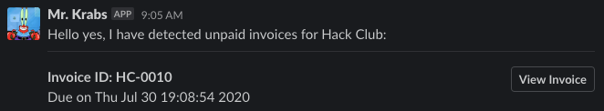

# Mr. Krabs - Automatic Stirpe invoice reminder for Slack

## Screenshot


## Configuration
Environment variable `KRABS` should be a dict (as a string) containing the following keys:
- `StripeKey` (Your Stripe API key)
- `StripeCustomer` (The Stripe ID of the Customer you wish to monitor)
- `SlackHook` (The Slack Webhook generated for this use)

(An example is located in the `example.env` file, which Docker will also accept with the `--env-file` flag)

## Getting Started
```bash
docker build -t MrKrabs:latest . # Build the container
docker run -d --env-file=krabs.env Mrkrabs:latest # Run said container
```

## License
MIT